<h1>Task 1</h1>
<h2>Step 1: Creating Instance</h2>

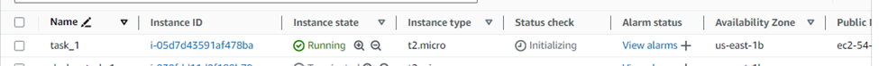

<h2>Step 2: Connecting with local pc</h2>

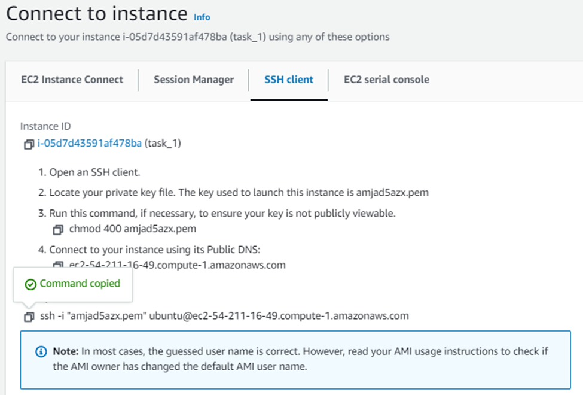

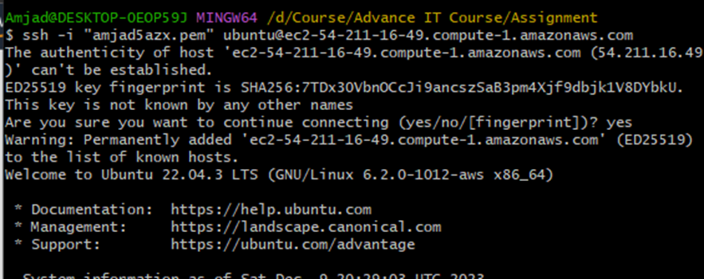

<h2>Step 3: Cloning Project</h2>

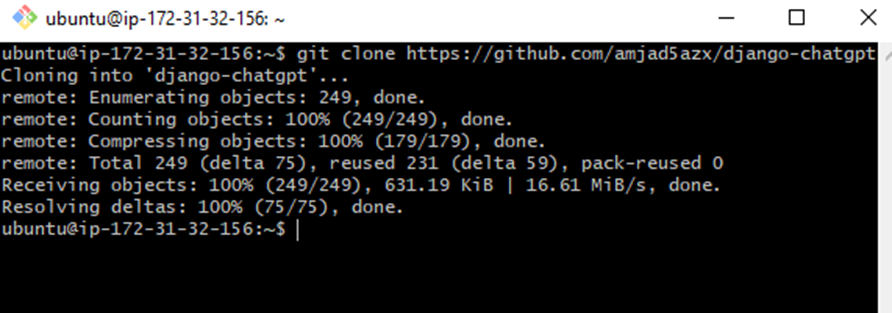

<h2>Step 4: Creating .env file</h2>

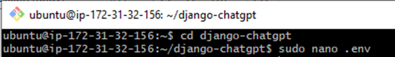

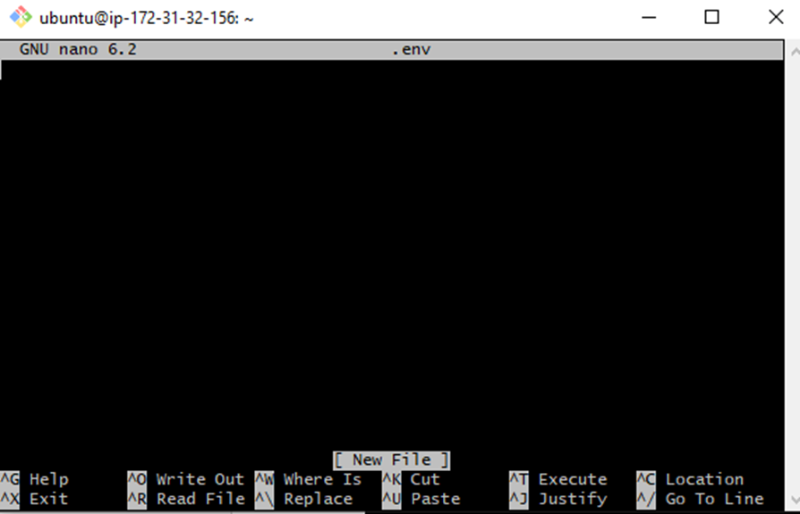

<h2>Step 5: Creating OpenAPI key</h2>

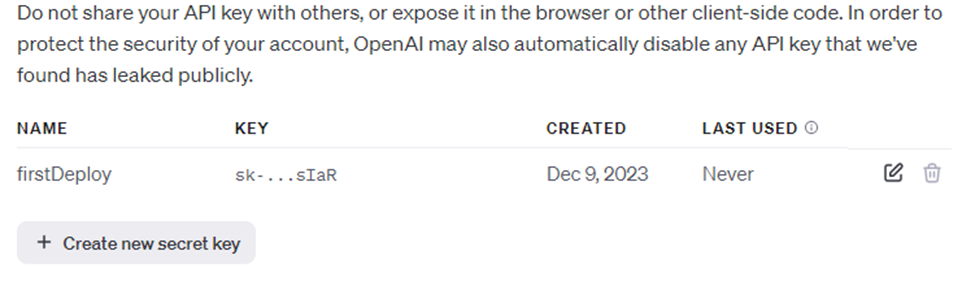

<h2>Step 6: Adding OpenAI Api in .env file</h2>

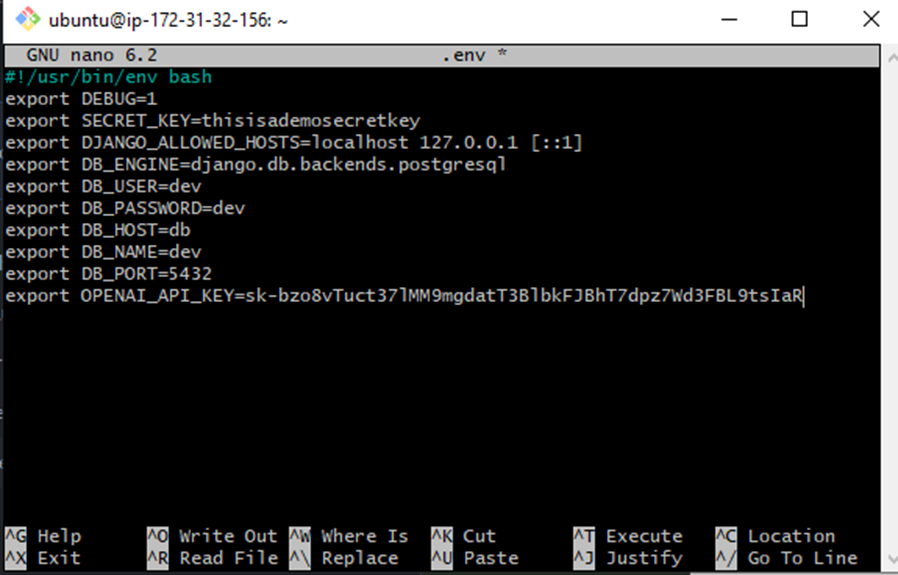

<h2>Step 7: Installing Docker-Compose</h2>

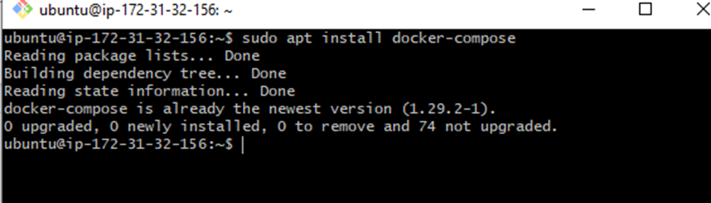

<h2>Step 8: Running Docker Compose Compose</h2>

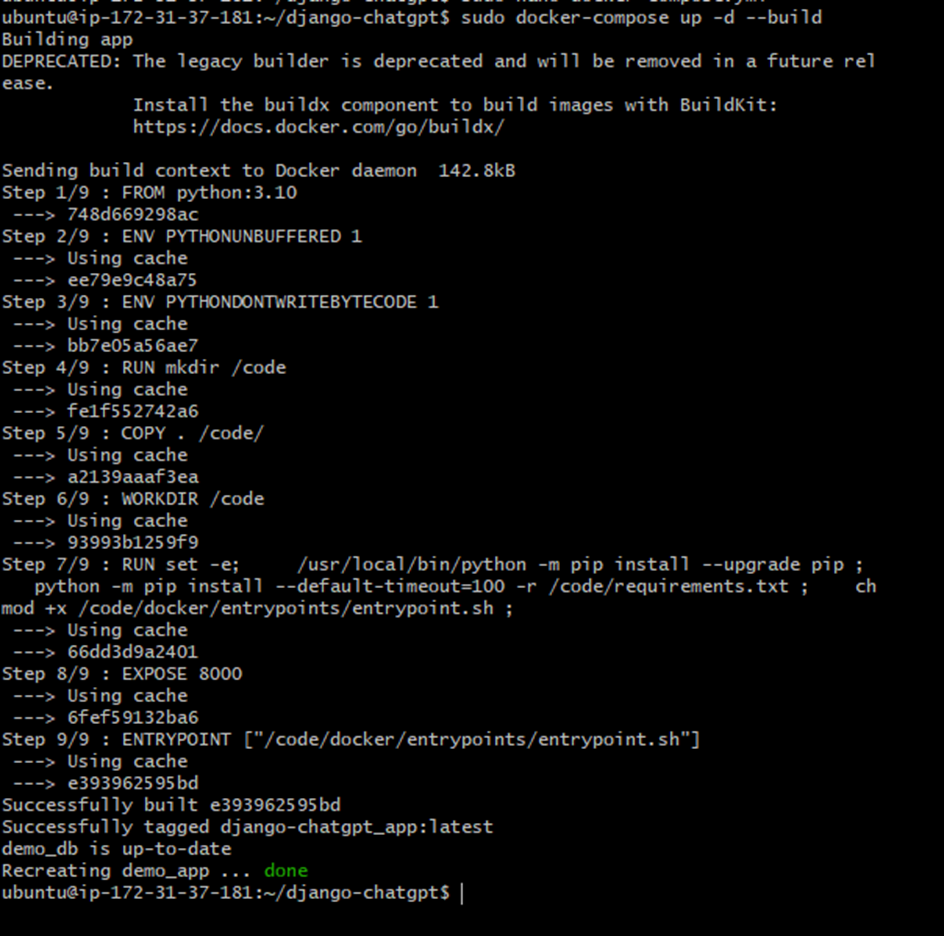

<h2>Step 9: Exposing 8000 port in Security Bound of AWS</h2>

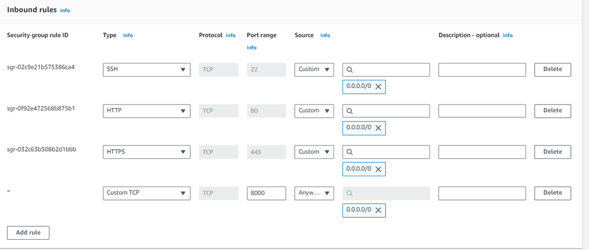

<h2>Step 10: Updating Setting.py file for allowing host</h2>

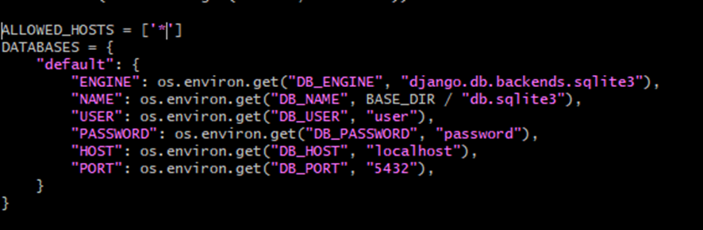

<h2>Result : App is now running</h2>

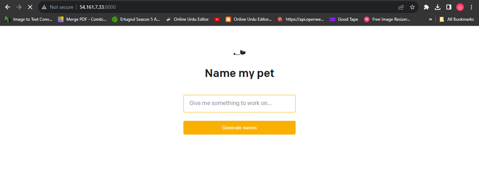

